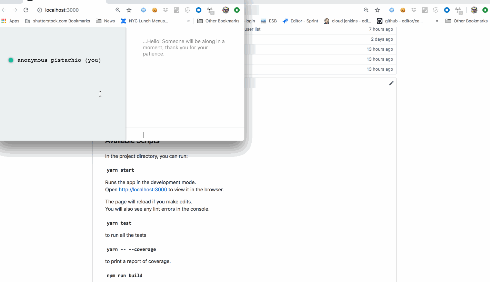

# wonder-chat
The best way to get started is with a `yarn install`

Then a `yarn start:dev`

## Available Scripts

In the project directory, you can run:

#### `yarn start:dev`

Runs the app in the development mode. 
Open [http://localhost:3000](http://localhost:3000) to view it in the browser.

The page will reload if you make edits. 
You will also see any lint errors in the console.

#### ` yarn test`

to run all the tests

#### `yarn -- --coverage`

to print a report of coverage.

A preview:

